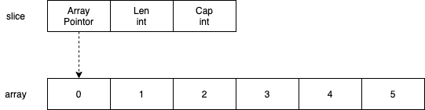

# How slice work with append()?

## Problem

See below code snippet and result.

```go
func sliceAppendA() {
	array := [6]int{0, 1, 2, 3, 4, 5}
	slice := array[1:3]

	newSlice := append(slice, 100)
	newSlice[1] += 100

	fmt.Printf("newSlice = %v\n", newSlice)
	fmt.Printf("slice = %v\n", slice)
	fmt.Printf("array = %v\n", array)
}
```

```bash
$ go run slice.go
newSlice = [1 102 100]
slice = [1 102]
array = [0 1 102 100 4 5]
```

From the result, we can see the Array variable `array` has been modified by `append()` and `+=` operation, even though the operation is occurred on Slice variables `slice` and `newSlice`. However, the behavior is different in below similar code snippet.

```go
func sliceAppendB() {
	array := [6]int{0, 1, 2, 3, 4, 5}
	slice := array[3:]

	newSlice := append(slice, 100)
	newSlice[1] += 100

	fmt.Printf("newSlice = %v\n", newSlice)
	fmt.Printf("slice = %v\n", slice)
	fmt.Printf("array = %v\n", array)
}
```

```bash
$ go run slice.go
newSlice = [3 104 5 100]
slice = [3 4 5]
array = [0 1 2 3 4 5]
```

From the result, we see the variable `array` was not changed at this time. So the question is why these similar code has different behavior?

## Array and Silce

Firstly, we need start the investigation from Array and Slice in Golang. See below code snippet.

```go
func arrayInit() {
	array1 := [3]int{0, 1, 2}
	array2 := array1

	fmt.Printf("array1 pointor = %p\n", &array1)
	fmt.Printf("array2 pointor = %p\n", &array2)

	func(array [3]int) {
		fmt.Printf("func.array pointor = %p\n", &array)
	}(array1)
}
```

```bash
$ go run slice.go
array1 pointor = 0xc000198000
array2 pointor = 0xc000198018
func.array pointor = 0xc000198048
```

Arrays in Golang are value types. This means that when you assign an array to a new variable or pass an array to a function, the entire array is copied. That's why the pointer value of variable `array1`, `array2` and `array` in `func` are different.
Slices in Golang is an internal struct which can reference to an array.

```go
type slice struct {
	array unsafe.Pointer
	len   int
	cap   int
}
```

See: https://golang.org/src/runtime/slice.go.

<p align='left'>
  
</p>

Let's go back to the function `sliceAppendA()` with more trace.

```go
func sliceAppendA() {
	array := [6]int{0, 1, 2, 3, 4, 5}
	slice := array[1:3]

	fmt.Printf("slice = %v, pointer = %p, len = %d, cap = %d\n", slice, &slice, len(slice), cap(slice))
	fmt.Printf("array = %v, pointer = %p, len = %d, cap = %d\n", array, &array, len(array), cap(array))

	fmt.Printf("slice[0] pointer = %p\n", &slice[0])
	fmt.Printf("array[1] pointer = %p\n", &array[1])

	newSlice := append(slice, 100)
	newSlice[1] += 100

	fmt.Println()
	fmt.Printf("newSlice = %v, pointer = %p, len = %d, cap = %d\n", newSlice, &newSlice, len(newSlice), cap(newSlice))
	fmt.Printf("slice = %v, pointer = %p, len = %d, cap = %d\n", slice, &slice, len(slice), cap(slice))
	fmt.Printf("array = %v, pointer = %p, len = %d, cap = %d\n", array, &array, len(array), cap(array))

	fmt.Printf("newSlice[0] pointer = %p\n", &newSlice[0])
	fmt.Printf("newSlice[1] pointer = %p\n", &newSlice[1])
	fmt.Printf("array[2] pointer = %p\n", &array[2])
}
```

```bash
$ go run slice.go
slice = [1 2], pointer = 0xc00011c018, len = 2, cap = 5
array = [0 1 2 3 4 5], pointer = 0xc000122030, len = 6, cap = 6
slice[0] pointer = 0xc000122038
array[1] pointer = 0xc000122038

newSlice = [1 102 100], pointer = 0xc00011c048, len = 3, cap = 5
slice = [1 102], pointer = 0xc00011c018, len = 2, cap = 5
array = [0 1 102 100 4 5], pointer = 0xc000122030, len = 6, cap = 6
newSlice[0] pointer = 0xc000122038
newSlice[1] pointer = 0xc000122040
array[2] pointer = 0xc000122040
```

From the result, we can see the pointer values of `slice[0]` , `array[1]` and `newSlice[0]` are same. Similar as `newSlice[1]` and `array[2]`. The summary of reference relationship is in below picture.

<p align='left'>
  
</p>

This can explain why `array` has been change in function `sliceAppendA()`.

## Append()

Now let's see how `append()` works.
In function `sliceAppendA()`, the `len` of the `slice` is 2 and the `cap` of the `slice` is 5 before `append()`. So `append()` just replaced the value of `slice[2]` with 100 and return `slice`.
However, this is just one case of `append()`. Let's see function `appendSliceB()` with more trace.

```go
func sliceAppendB() {
	array := [6]int{0, 1, 2, 3, 4, 5}
	slice := array[3:]

	fmt.Printf("slice = %v, pointer = %p, len = %d, cap = %d\n", slice, &slice, len(slice), cap(slice))
	fmt.Printf("array = %v, pointer = %p, len = %d, cap = %d\n", array, &array, len(array), cap(array))

	fmt.Printf("slice[0] pointer = %p\n", &slice[0])
	fmt.Printf("array[3] pointer = %p\n", &array[3])

	newSlice := append(slice, 100)
	newSlice[1] += 100

	fmt.Println()
	fmt.Printf("newSlice = %v, pointer = %p, len = %d, cap = %d\n", newSlice, &newSlice, len(newSlice), cap(newSlice))
	fmt.Printf("slice = %v, pointer = %p, len = %d, cap = %d\n", slice, &slice, len(slice), cap(slice))
	fmt.Printf("array = %v, pointer = %p, len = %d, cap = %d\n", array, &array, len(array), cap(array))

	fmt.Printf("newSlice[0] pointer = %p\n", &newSlice[0])
	fmt.Printf("newSlice[1] pointer = %p\n", &newSlice[1])
	fmt.Printf("array[4] pointer = %p\n", &array[4])
}
```

```bash
$ go run slice.go
slice = [3 4 5], pointer = 0xc00000c030, len = 3, cap = 3
array = [0 1 2 3 4 5], pointer = 0xc00001c090, len = 6, cap = 6
slice[0] pointer = 0xc00001c0a8
array[3] pointer = 0xc00001c0a8

newSlice = [3 104 5 100], pointer = 0xc00000c060, len = 4, cap = 6
slice = [3 4 5], pointer = 0xc00000c030, len = 3, cap = 3
array = [0 1 2 3 4 5], pointer = 0xc00001c090, len = 6, cap = 6
newSlice[0] pointer = 0xc00001c0f0
newSlice[1] pointer = 0xc00001c0f8
array[4] pointer = 0xc00001c0b0
```

In this case, we can see `newSlice[0] != slice[0]` and `newSlice[0] != array[3]`, but `slice[0] == array[3]`. This is because when `append()` tried to append to `slice`, it found the `cap` of `slice` was reached to maximum value 3. So it tried to enlarge with a copy operation with a new array. So any operations on new slice will not impact `slice` and `array` variables.

## Conclusion

1. Arrays are value types.
2. Slices are internal struct which can reference to an array.
3. If `append()` will not enlarge the slice, it will return a slice referenced to original array.
4. If `append()` will enlarge the slice, it will return a slice referenced to a new copied array.